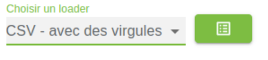

Voici deux fichiers nécessaires pour créer un site simple rapidement avec Lodex.

Le premier fichier, nommé [data.csv](data.csv), contient des notices, ici des films. Ce fichier se charge dans l’outil en sélectionnant le loader : “CSV - avec des virgules”

Le second fichier, nommé [model.tar](model.tar), contient un modèle permettant de créer un site adapté au fichier importé. Ce modèle contient toutes les configurations réalisées dans l’interface : choix et organisation des champs, configuration des affichages, etc.

Ce fichier permet de sauvegarder son travail de configuration réalisée dans les interfaces.

Une fois les deux fichiers chargés, vous pouvez lancer la publication

et obtenir un site à partir de votre fichier de départ.

Lodex est extrêmement configurable, et donc parfois complexe, il est capable de charger divers formats. Les champs peuvent être retravaillés, corrigés et affichés de différentes manières (Enrichissements, Transformations, Formats). Plusieurs types de graphiques sont possibles via différents calculs et agrégations de données (Routines) 

Pour aller plus loin, il y a une documentation en cours de réalisation : https://lodex.inist.fr/docs/partie-2-2/
