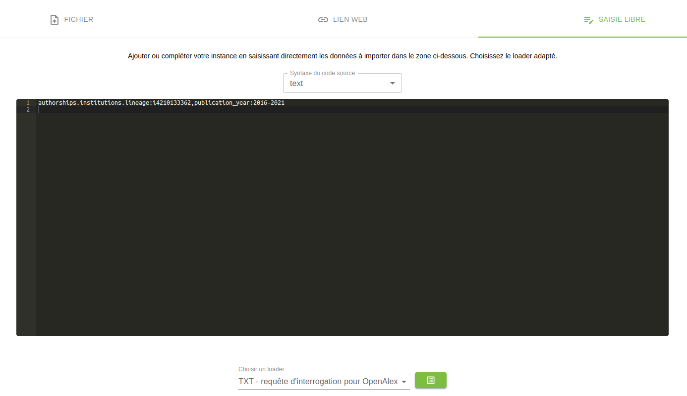

# OpenAlex


## 1. Use a request like : 

```
authorships.institutions.lineage:i4210144781,publication_year:2016-2021
```



## 2. Choose the right loader and load the result of your query :

```
OpenAlex Query
```


## 3. Upload the model :


## 4.  Launch all enrichments in the order displayed :
click successively on all "START" buttons, starting with the first one at the top of the list.


## 5. Publish and Explore your data


View public website


